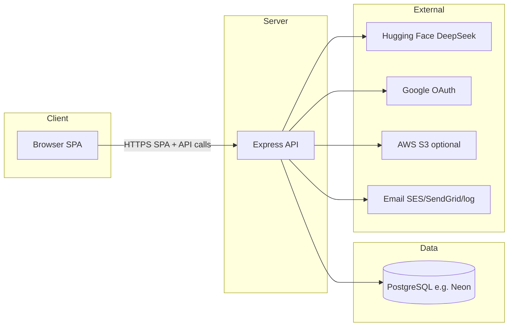
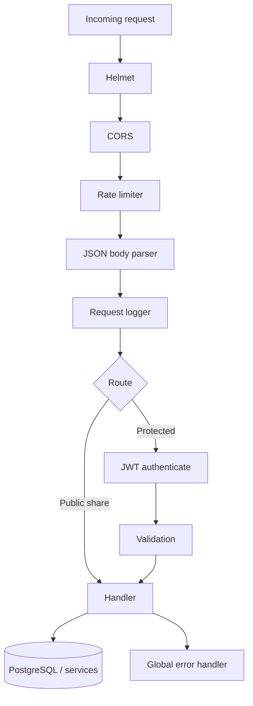
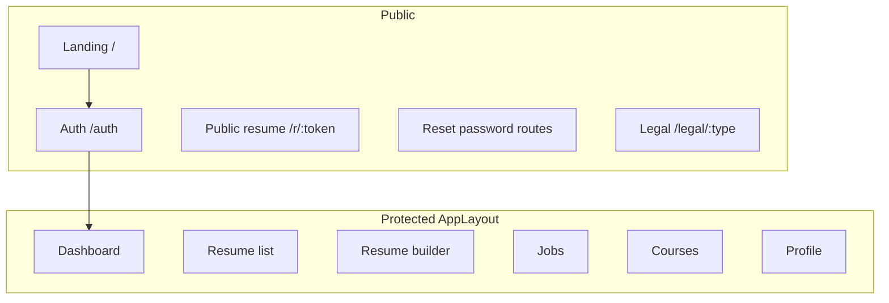

# Modex (ResumeAI) — Technical Project Report

**Document type:** Technical design and architecture reference  
**Audience:** Developers, technical leads, and academic or stakeholder reviewers  
**Repository:** Monorepo (`frontend` + `backend` npm workspaces)  
**Product names in use:** Modex (README), ResumeAI (CI workflow), folder `resumeai`

---

## Table of contents

1. [Executive summary](#1-executive-summary)  
2. [System overview](#2-system-overview)  
3. [Technology stack](#3-technology-stack)  
4. [Repository structure](#4-repository-structure)  
5. [Architecture — diagrams](#5-architecture--diagrams)  
6. [Backend](#6-backend)  
7. [Frontend](#7-frontend)  
8. [Data model](#8-data-model)  
9. [End-to-end flows](#9-end-to-end-flows)  
10. [Security and operations](#10-security-and-operations)  
11. [Deployment](#11-deployment)  
12. [Appendix A — Environment variables](#appendix-a--environment-variables)  
13. [Appendix B — API route map](#appendix-b--api-route-map)  
14. [Appendix C — Known documentation drift](#appendix-c--known-documentation-drift)  

---

## 1. Executive summary

Modex is a full-stack web application that helps users build, customize, and improve résumés with AI-assisted features. The system includes applicant-tracking-style scoring, bullet rewriting, summary generation, tailoring to job descriptions, job matching suggestions, course recommendations, version history, public share links, and authentication via email/password and Google OAuth.

The application separates concerns into a **React single-page application** (SPA) for the user interface and a **Node.js Express API** for authentication, persistence, file handling, and AI orchestration. Data is stored in **PostgreSQL** — commonly **[Neon](https://neon.tech)** in production alongside **Vercel** for hosting. AI uses **DeepSeek** models through the **Hugging Face Inference API**. Optional integrations support **AWS** (S3 uploads, SES email) and self-hosted deploys (see `docs/AWS_DEPLOYMENT.md`).

---

## 2. System overview

At a high level:

- The **browser** loads the React app and talks to the API over HTTPS (or HTTP in development).
- The **API** validates requests, enforces rate limits, issues and checks JWTs, reads/writes the database, and calls external AI and email services.
- **PostgreSQL** holds users, résumés, snapshots, jobs, courses, shares, and audit metadata.

---

## 3. Technology stack

| Layer | Technology |
|-------|------------|
| Monorepo | npm workspaces, `concurrently` for parallel dev |
| Frontend | React 18, Vite, React Router 6, Tailwind CSS, Zustand, Axios, Framer Motion, react-hot-toast |
| Export (client) | jsPDF, html2canvas (PDF); `docx` (Word) |
| Backend | Node.js, Express, `pg`, node-pg-migrate |
| Auth | JWT (HS256), bcrypt, Google OAuth (`google-auth-library`) |
| Parsing | pdf-parse (PDF), mammoth (DOCX) |
| AI (current implementation) | Hugging Face Inference API (`@huggingface/inference`), DeepSeek model chain; `AI_MOCK_MODE` for tests |
| Optional / legacy deps | `@anthropic-ai/sdk`, `@google/generative-ai` present in `package.json` but primary path in `aiService.js` is Hugging Face |
| Hardening | Helmet, CORS allowlist, express-rate-limit, express-validator |
| Logging | Winston |
| Testing | Jest, Supertest (backend) |
| Containers | Docker, docker-compose |
| CI | GitHub Actions |
| Process manager (optional) | PM2 (`ecosystem.config.js`) |
| Production hosting | **Vercel** — separate projects for `frontend/` and `backend/` |
| Production database | **Neon** PostgreSQL (or any Postgres; `DATABASE_URL`) |

---

## 4. Repository structure

| Path | Purpose |
|------|---------|
| `/package.json` | Root scripts: `dev`, `build`, `test`, `db:migrate`, `db:seed` |
| `/frontend/` | Vite + React SPA |
| `/backend/` | Express API, migrations, seeds, tests |
| `/docs/` | Architecture, setup, AWS guide, **this report** |
| `/.github/workflows/` | CI: migrations, backend tests, frontend build |
| `/docker-compose.yml`, `docker-compose.dev.yml` | Local/production-style stacks |
| `/Makefile`, `setup.sh`, `deploy.sh` | Automation helpers |
| `/tmp/` | Experimental scripts (not production) |
| `vercel.json` (root / frontend / backend) | Serverless deployment configuration |
| `SECURITY.md`, `CONTRIBUTING.md`, `CHANGELOG.md`, `QUICKSTART.md` | Project governance and onboarding |

---

## 5. Architecture — diagrams

### 5.1 Logical deployment view



### 5.2 Request pipeline (backend)



### 5.3 Frontend routing (conceptual)



---

## 6. Backend

### 6.1 Entry points

| File | Role |
|------|------|
| `src/server.js` | Validates env in production, starts HTTP listener when not in test/serverless-only mode |
| `src/app.js` | Composes middleware, mounts routes (with and without `/api` prefix), health check, static `/uploads` |
| `api/index.js` | Serverless entry (e.g. Vercel): exports app without calling `listen` |

### 6.2 Route modules

| Module | Responsibility |
|--------|----------------|
| `routes/auth.js` | Google token exchange, register, login, `/me`, logout, forgot/reset password |
| `routes/users.js` | Profile CRUD, dashboard aggregates |
| `routes/resumes.js` | List/create/get/update/delete, upload+text extraction, duplicate, versioning |
| `routes/ai.js` | Parse text to JSON, ATS analysis, improve bullet, summary, job matches, courses, tailor |
| `routes/share.js` | Generate/revoke share link, public fetch by token, stats |
| `routes/jobs.js` / `routes/courses.js` | Re-export routers from `jobs_courses.js` (saved jobs, course history) |

### 6.3 Middleware and services

| Component | Role |
|-----------|------|
| `middleware/auth.js` | JWT verification, `req.userId` |
| `middleware/validate.js` | Async handlers, validation helpers |
| `middleware/auditLog.js` | Audit trail for mutations |
| `middleware/requestLogger.js` | Structured request logging |
| `services/aiService.js` | `ask`, `askJSON`, `parseJSON` — HF calls, retries, JSON cleanup |
| `services/uploadService.js` | Local disk vs S3 |
| `services/emailService.js` | Log vs SES vs SendGrid |
| `models/db.js` | `pg` connection pool and `query` helper |

### 6.4 Database migrations

Located under `backend/migrations/`, applied with `node-pg-migrate` (`npm run db:migrate`). Seed data: `npm run db:seed` → `src/utils/seed.js`.

---

## 7. Frontend

### 7.1 Entry and shell

| File | Role |
|------|------|
| `src/main.jsx` | React root, `BrowserRouter`, Toaster, outer ErrorBoundary, global CSS |
| `src/App.jsx` | Route table, auth hydration, `ProtectedRoute` / `PublicRoute` |

### 7.2 State (Zustand)

| Store | Responsibility |
|-------|----------------|
| `authStore` | User, token, persistence across reloads |
| `resumeStore` | Résumé list, current document, loading/saving, ATS cache |
| `jobStore` | Saved jobs and search-related UI state |
| `courseStore` | Course recommendations state |

### 7.3 Notable pages

| Route | Page |
|-------|------|
| `/` | Landing |
| `/auth` | Login / register |
| `/dashboard` | Overview |
| `/resumes` | List |
| `/resumes/new`, `/resumes/:id/edit` | Builder |
| `/jobs`, `/courses` | Job and learning features |
| `/profile` | User profile |
| `/r/:token` | Public shared résumé |
| `/legal/:type` | Legal content |
| `/auth/forgot-password`, `/auth/reset-password` | Password reset flow |

### 7.4 Builder composition (conceptual)

The resume builder typically combines: form editor, template picker, customization panel, AI toolbar (ATS, bullets, summary, tailor), export panel (PDF/HTML/share), and a live preview canvas.

### 7.5 HTTP client

`src/utils/api.js` configures Axios with `VITE_API_URL`, handles 401 (logout + redirect), and surfaces rate-limit and server errors via toasts.

### 7.6 Custom hooks (barrel: `src/hooks/index.js`)

Includes: `useAuth`, `useResume`, `useAutoSave`, `useDebounce`, `useLocalStorage`, `useToast`, `useConfirm`, `useTitle`, `useWindowSize`, `useScrollToTop`, `useKeyboardShortcut`, `useBuilderShortcuts`.

---

## 8. Data model

Principal tables (see `docs/ARCHITECTURE.md` for full list): `users`, `user_profiles`, `resumes`, `resume_versions`, `work_experiences`, `educations`, `projects`, `certifications`, `resume_shares`, `user_sessions`, `password_reset_tokens`, `job_searches`, `saved_jobs`, `course_recommendations`, `audit_logs`.

**Design note:** Primary editable payload for the builder is often stored in `resumes.content` (JSONB). Normalized section tables support structured access and seeding; synchronization strategy is documented in architecture notes.

**Sharing:** Public links use high-entropy tokens; expiry enforced server-side where applicable.

---

## 9. End-to-end flows

### 9.1 Authentication

1. User registers or logs in (or uses Google).  
2. API returns JWT; client stores it (persisted store).  
3. Subsequent API calls send `Authorization: Bearer <token>`.  
4. On 401, client clears session and redirects to `/auth`.

### 9.2 Create and edit résumé

1. Client loads or creates résumé via `/api/resumes`.  
2. User edits sections and styling; debounced or explicit save sends `PUT` with content.  
3. Server may persist version snapshots.  
4. AI features POST to `/api/ai/*` with context; responses update local state.

### 9.3 Upload and parse

1. User uploads PDF/DOCX to upload endpoint.  
2. Server extracts text.  
3. Optional AI parse structures text into JSON for form population.

### 9.4 Public share

1. Authenticated user requests share link generation for a résumé.  
2. Server stores token.  
3. Visitor opens `/r/:token`; client fetches public payload without JWT.

---

## 10. Security and operations

- **Helmet** for security headers; **CORS** restricted to configured origins (including Vercel preview logic when `FRONTEND_URL` targets Vercel).  
- **Rate limiting:** global on `/api/` and stricter on `/api/ai/`.  
- **Passwords:** bcrypt.  
- **JWT:** HS256; validate on protected routes.  
- **SQL:** parameterized queries via `pg`.  
- **Uploads:** type/size constraints (see implementation).  
- **Health:** `GET /health` includes database check for orchestration.

Refer to `docs/ARCHITECTURE.md` security checklist for explicit items and TODOs (e.g. refresh tokens, CAPTCHA).

---

## 11. Deployment

- **Vercel (current):** Two projects — root `frontend/` (Vite static build) and root `backend/` (Express serverless). Set **`DATABASE_URL`** to **[Neon](https://neon.tech)** (pooled URI recommended). Set **`HUGGINGFACE_API_KEY`** for AI. Frontend **`VITE_API_URL`** must be the **absolute** backend URL. Details: `VERCEL_SETUP.md`.  
- **Docker Compose:** Local Postgres + backend + frontend; set secrets via env files.  
- **GitHub Actions:** On `main`, run migrations against test DB, backend tests, frontend production build.  
- **AWS (alternative):** See `docs/AWS_DEPLOYMENT.md` for EC2 + RDS style deployment.

---

## Appendix A — Environment variables

### Backend (representative)

| Variable | Notes |
|----------|--------|
| `NODE_ENV` | `development` / `production` / `test` |
| `PORT` | Default 5000 |
| `DATABASE_URL` | PostgreSQL URL (local, Docker, **Neon**, RDS, …) |
| `JWT_SECRET` | Strong secret for signing |
| `JWT_EXPIRES_IN` | Optional TTL |
| `FRONTEND_URL` | CORS and email link base |
| `GOOGLE_CLIENT_ID` / `GOOGLE_CLIENT_SECRET` | OAuth |
| `HUGGINGFACE_API_KEY` | Required for live AI in current `aiService` |
| `AI_MOCK_MODE` | `true` for deterministic mock JSON in development/tests |
| `EMAIL_PROVIDER`, `EMAIL_FROM` | Email channel |
| AWS variables | S3 / SES when enabled |

### Frontend

| Variable | Notes |
|----------|--------|
| `VITE_API_URL` | Backend base URL including `/api` path as used by the client |
| `VITE_GOOGLE_CLIENT_ID` | Google sign-in button |

Full tables: `docs/ARCHITECTURE.md`.

---

## Appendix B — API route map

Mounted under both `/` and `/api` (duplicate mount for compatibility). Protected routes require JWT unless noted.

| Method | Path (under mount) | Auth | Description |
|--------|-------------------|------|---------------|
| POST | `/auth/google` | No | Google OAuth |
| POST | `/auth/register` | No | Register |
| POST | `/auth/login` | No | Login |
| GET | `/auth/me` | Yes | Current user |
| POST | `/auth/logout` | Yes | Logout (client clears token) |
| POST | `/auth/forgot-password` | No | Request reset email |
| POST | `/auth/reset-password` | No | Complete reset |
| GET/PUT | `/users/profile` | Yes | Profile |
| GET | `/users/dashboard` | Yes | Dashboard stats |
| GET/POST | `/resumes` | Yes | List / create |
| GET/PUT/DELETE | `/resumes/:id` | Yes | CRUD |
| POST | `/resumes/upload/parse` | Yes | Upload extract |
| POST | `/resumes/:id/duplicate` | Yes | Duplicate |
| POST | `/ai/*` | Yes | AI endpoints (rate limited) |
| GET/POST/PATCH/DELETE | `/jobs/*` | Yes | Saved jobs |
| GET/POST | `/courses/*` | Yes | Course history / recommendations |
| POST | `/share/:resumeId/generate` | Yes | Create link |
| GET | `/share/:token` | No | Public view |
| DELETE | `/share/:resumeId` | Yes | Revoke |
| GET | `/share/:resumeId/stats` | Yes | Stats |

Exact paths and validators: source files under `backend/src/routes/`.

---

## Appendix C — Naming and leftovers

1. **Product naming:** Modex (README), ResumeAI (CI workflow title), folder `resumeai` — align naming in external submissions.  
2. **`tmp/`** scripts are for development experiments and should not be described as production components.  
3. **Optional npm deps** (`@anthropic-ai/sdk`, etc.) may exist for experiments; production AI path is **Hugging Face + DeepSeek** in `aiService.js`.

---

## Exporting to PDF

**Option A — VS Code / Cursor:** Open this file and use a Markdown PDF extension (e.g. “Markdown PDF”) to export.

**Option B — Pandoc:**

```bash
pandoc docs/PROJECT_REPORT.md -o Modex_Project_Report.pdf --toc -V geometry:margin=1in
```

**Option C — Browser:** Print the rendered Markdown preview to PDF (ensure Mermaid is rendered first if diagrams must appear; some exporters need a Mermaid-capable preview or pre-rendered images).

---

*End of report.*
